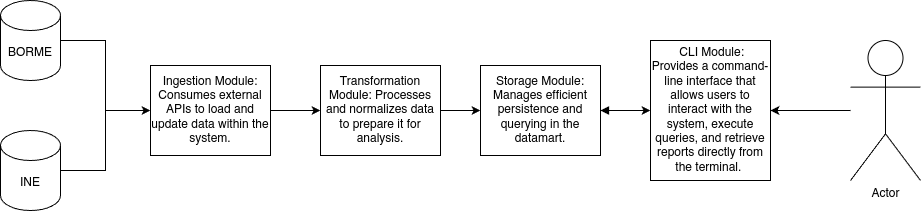

# BusXPop

BusxPop is a command-line Java application designed to analyze and report the socioeconomical impact of business creation and dissolution at a small-scale level in Spain.

The application connects to both the BORME (Boletín Oficial del Registro Mercantil) and INE (Instituto Nacional de Estadística) APIs to gather data on business activity and population metrics. This data is ingested into a datalake, then processed and structured into a datamart by a dedicated business logic unit. Finally, the application performs statistical analysis on the curated data and generates a results database to support socioeconomical insights.

## Justification of API Choices and Datamart Structure

-   **Selected APIs:**
    -   **BORME:** Official source for real-time data on company registrations and dissolutions.\
    -   **INE:** Provides key statistical data on population, employment, and regional socio-economic indicators.

This combination allows cross-referencing economic activity with demographic indicators, essential for comprehensive socio-economic analysis.

-   **Datamart Structure:**\
    The datamart is designed to organize and optimize queries on aggregated and correlated data, enabling fast analyses and report generation. It contains key tables integrating temporal, geographical, and sectorial variables for multivariate analysis.

### Workflow Overview

#### Data Acquisition

-   Fetches business data from BORME API

-   Fetches demographic and employment data from INE API

#### Data Integration

-   Stores raw data in a centralized datalake

#### Processing & Transformation

-   Business logic module builds a structured datamart for analysis

#### Analysis & Output

-   Performs correlation and statistical analysis

-   Generates a results database for consultation via the CLI

### Features

#### API Integration

-   Connects to official Spanish data sources:
-   BORME API for real-time business registration and dissolution data
-   INE API for population, employment, and regional socioeconomical indicators

#### Datalake Storage

-   Centralized ingestion of raw data for persistent and scalable storage Datamart Construction
-   Transforms and structures data into an analysis-ready format using business logic modules

#### Socioeconomic Analysis

-   Correlates business lifecycle data with population trends and employment metrics at the local level

#### Results Database

-   Stores precomputed analytical results in a queryable SQLite database

#### Asynchronous Processing

-   Utilizes ActiveMQ for decoupled and efficient data processing pipelines

#### CLI Interface

-   Lightweight command-line interface for consulting datasets, generating reports, and navigating analysis results

### Installation

#### **Prerequisites**

Before you begin, ensure you have the following installed:

-   **Java 21** (with preview features enabled)\
-   **Apache Maven 3.8+**\
-   **ActiveMQ Broker** (optional, but required for full functionality)\
-   Internet access for Maven to download dependencies

#### **Clone the Repository**

```         
git clone https://github.com/yourusername/BusxPop.git
cd BusxPop
```

#### **Build the Project**

```         
mvn clean package
```

This will generate shaded JAR files for each module (e.g., `BormeFeeder`, `IneFeeder`, `BusinessUnit`) under their respective `target/` folders.

#### **Run the Application**

```         
At the moment, all the modules must be run from main, as the implementation of a launcher has been unsucesfull.
```

> Make sure your ActiveMQ server is running and correctly configured, if your use case involves messaging.

#### **Configuration**

-   SQLite databases are embedded and automatically managed via HikariCP.\
-   Configuration (e.g., DB paths, API tokens) can be set via environment variables or configuration files, depending on your implementation.

### Usage instructions

Once launched, both feeder modules fetch data every 24 hours to ActiveMQ. You can also open them on localhost for aditional usabilities, such as fetch on click, or custom queries.

Once the Bussiness unit CLI is launched, you may use it to observe the effects it calculates.

## System Architecture

The system architecture is designed to ensure scalability, modularity, and maintainability. It follows a **layered architecture** that clearly separates responsibilities:

-   **Presentation Layer:** The user interface or API that handles incoming requests and presents results.

-   **Business Logic Layer:** Modules where data processing, validation, business rules, and data transformation occur.

-   **Data Layer:** The database and datamart where structured information is stored for analysis and reporting.

    Each component communicates through well-defined APIs, allowing independence and enabling updates or replacements without impacting the entire system.

## Application Architecture

The application is organized into independent modules with clear responsibilities, following a modular architecture:

-   **Ingestion Module:** Consumes external APIs to load and update data within the system.

-   **Transformation Module:** Processes and normalizes data to prepare it for analysis.

-   **Storage Module:** Manages efficient persistence and querying in the datamart.

-   **CLI Module:** Provides a command-line interface that allows users to interact with the system, execute queries, and retrieve reports directly from the terminal.

This structure promotes code reuse across modules, with the CLI acting as the presentation layer, enabling flexible interaction without the need for graphical interfaces or web services.



## Design Principles and Patterns Applied

All modules have been made with IPO and command patterns taken into consideration. Most of the modules also use Factories.

### Ingestion Module

-   **Principles:** Single Responsibility, Open/Closed

-   **Patterns:** Adapter Pattern to connect with different external APIs, Retry Pattern for fault tolerance in API calls, Pub-Sub pattern to connect to ActiveMQ

### Transformation Module

-   **Principles:** Separation of Concerns, DRY (Don't Repeat Yourself)

-   **Patterns:** Pipeline Pattern to process data step-by-step.

    ### Storage Module

-   **Principles:** Encapsulation, Interface Segregation

### CLI Module

-   **Principles:** Command Query Separation, User-Centered Design.
